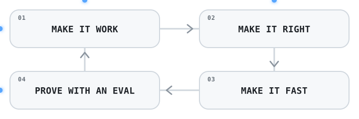

<div align="center">


</div>

## whoami

```typescript
const WeiGuang = {
  role: "Software Engineer",
  builds: [
    "AI systems",
    "distributed backends",
    "full-stack products",
  ],
  languages: ["TypeScript", "Python", "Java"],
  focusedOn: [
    "RAG evaluation",
    "multi-agent workflows",
    "systems under load",
  ],
  philosophy:
    "Make it work -> make it right -> make it fast -> " +
    "prove it with an eval",
};
```

<div align="center">
  <picture>
    <source media="(prefers-color-scheme: dark)" srcset="./assets/engineering-loop-dark.svg">
    <source media="(prefers-color-scheme: light)" srcset="./assets/engineering-loop-light.svg">
    
  </picture>
</div>

---

## Featured Projects

### [Production-RAG](https://github.com/WeiGuang-2099/Production-RAG) -- Production-grade RAG system

An end-to-end retrieval system built around measurable quality: hybrid search, GraphRAG expansion, reranking, grounded citations, and refusal for unsupported questions.

- Hybrid RRF lifted recall@5 from `0.934` to `0.972` at no latency cost; a 4.6x adversarial corpus test exposed where reranking adds the most value.
- Grounded generation achieved `5/5` correct refusals on unanswerable questions, compared with `0/5` for the baseline prompt.
- Includes API-edge guardrails, task-based model routing, semantic caching, cost accounting, an MCP server, 219 mocked tests, and Docker Compose deployment.

`Python` `FastAPI` `Qdrant` `GraphRAG` `RAGAS` `Docker`

### [High-Concurrency Auction Platform](https://github.com/WeiGuang-2099/High-concurrency-Distributed-Event-Driven-System) -- Distributed event-driven backend

A real-time auction and ticketing platform designed to preserve correctness under heavy contention across Redis, Kafka, RabbitMQ, MongoDB, and MySQL.

- 2,000 concurrent reserve attempts against 100 units sold exactly 100, with zero oversell and zero errors.
- Sustained about `3,560 bids/s` with zero lost bids on the Redis hot path and p95 latency of `71 ms`.
- Redis Lua achieved about `1.5x` the throughput of `SELECT ... FOR UPDATE` at equal correctness; the system also includes CQRS, event replay, tracing, and Testcontainers coverage.

`Java 17` `Spring Boot 3` `Kafka` `Redis` `MongoDB` `Docker`

### [Smart Code Assistant](https://github.com/WeiGuang-2099/Smart_Code_Assistant) -- AI code intelligence platform

A full-stack code analysis platform combining an AST-derived Neo4j dependency graph, ChromaDB retrieval, LangChain agents, and typed SSE streaming.

- A 50-question golden-set harness guided three measured iterations, lifting hybrid hit rate@5 from `0.60` to `0.68`.
- Ships with about 300 backend tests, 54+ frontend tests, coverage gates, type checks, and k6 load tests.
- Includes OpenTelemetry tracing, Prometheus metrics, JWT and Argon2 authentication, token revocation, and an MCP server for code-graph access.

`TypeScript` `React 19` `FastAPI` `Neo4j` `ChromaDB` `OpenTelemetry`

---

## Open Source

### [internetarchive/openlibrary PR #12748](https://github.com/internetarchive/openlibrary/pull/12748)

Performance work on a high-traffic production Python codebase: replaced six N+1 query hotspots across four modules with batched reads, preserving behaviour while iterating through 22 commits of maintainer review.

---

<details>
<summary><b>More Projects</b></summary>
<br>

- **[AgentForge](https://github.com/WeiGuang-2099/AgentForge)** -- Deployable single-agent, multi-agent, and visual workflow platform with configurable models and memory. `Next.js` `FastAPI` `LiteLLM` `PostgreSQL`
- **[ecoCart](https://github.com/WeiGuang-2099/ecoCart)** -- Privacy-first carbon scanner with in-browser barcode detection and Australian-localized emissions modelling. `React` `Node.js` `ONNX Runtime` `PWA`
- **[RAG-it](https://github.com/WeiGuang-2099/RAG-it)** -- GraphRAG code analysis with dependency graphs, semantic search, and streaming architecture Q&A. `FastAPI` `React` `NetworkX` `WebSocket`
- **[graphRAG](https://github.com/WeiGuang-2099/graphRAG)** -- IT operations assistant using a service knowledge graph for dependency-aware fault tracing. `Neo4j` `Vue` `D3.js` `FastAPI`
- **[MovieWhisper](https://github.com/WeiGuang-2099/MovieWhisper)** -- Explainable hybrid movie recommendations with a justification for every result. `Python` `Streamlit` `scikit-learn` `Plotly`
- **[CRUD-Demo-Project](https://github.com/WeiGuang-2099/CRUD-Demo-Project)** -- Interactive teaching platform for HTTP, CORS, CRUD, WebSocket, and transaction flows. `React` `Node.js` `Express` `WebSocket`
- **[pdf2md](https://github.com/WeiGuang-2099/pdf2md)** -- PDF-to-Markdown conversion utility. `TypeScript`

</details>

---

## Tech Stack

**Languages:** `Python` `TypeScript` `Java` `JavaScript`

**Application:** `React` `Node.js` `FastAPI` `Spring Boot`

**Data & Infrastructure:** `PostgreSQL` `Redis` `Kafka` `Docker` `Neo4j`

**AI Systems:** `LangChain` `Qdrant` `ChromaDB` `GraphRAG`

---

## Currently Building

Currently exploring multi-agent workflows, graph-based RAG, and backends that stay correct under load.
